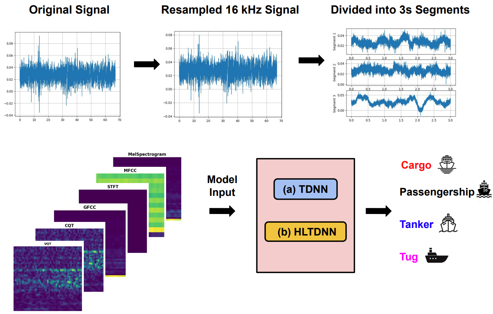

# Histogram Layer Time Delay Neural Networks:
<p align="center">
  
</p>


**Histogram Layer Time Delay Neural Networks For Passive Sonar Classification**

Jarin Ritu, Ethan Barnes, Riley Martell, Alexandra Van Dine and Joshua Peeples

Note: If this code is used, cite it: Jarin Ritu, Ethan Barnes, Riley Martell, Alexandra Van Dine and Joshua Peeples. (2023, July 25) Peeples-Lab/HLTDNN: Initial Release (Version v1.0). 
[`Zendo`](https://doi.org/10.5281/zenodo.8184517).https://zenodo.org/record/8184517
[](https://doi.org/10.5281/zenodo.8184517)

[`IEEE Xplore`](https://ieeexplore.ieee.org/abstract/document/10248102)

[`arXiv`](https://arxiv.org/abs/2307.13788)

[`BibTeX`](#CitingHist)


In this repository, we provide the paper and code for "Histogram Layer Time Delay Neural Network For Passive Sonar Classification."

## Installation Prerequisites


The [`requirements.txt`](requirements.txt) file includes all the necessary packages, and the packages will be installed using:

   ```pip install -r requirements.txt```

Or, for a more convenient option, a pre-configured environment is available for download through the provided link. This environment comes with all the essential packages already installed, ensuring a hassle-free setup process.

[`Download environment`](https://drive.google.com/file/d/1kASSpbMOtZCNF54oRXqUwxzxEGhF0YPg/view?usp=sharing)

## Demo

To get started, please follow the instructions in the [Datasets](Datasets) folder to download the dataset.
Next, run [`demo.py`](demo.py) in Python IDE (e.g., Spyder) or command line to train, validate, and test models. 
To evaluate performance,
run [`View_Results.py`](View_Results.py) (if results are saved out).

[The results may vary from the paper as we updated the data loading and data normalization]

## Main Functions

The target classification code uses the following functions. 

1. Intialize model  

   ```model, input_size, feature_layer = intialize_model(**Parameters)```

2. Prepare dataset(s) for model
   
   ```dataloaders_dict = Prepare_Dataloaders(**Parameters)```

3. Train model 

   ```train_dict = train_model(**Parameters)```

4. Test model

   ```test_dict = test_model(**Parameters)```


## Parameters

The parameters can be set in the following script:
   
[`Demo_Parameters.py`](Demo_Parameters.py)

## Inventory

```
https://github.com/Peeples-Lab/HLTDNN 

└── root directory
    ├── demo.py                           // Run this. Main demo file.
    ├── Demo_Parameters.py                // Parameter file for the demo.
    ├── Prepare_Data.py                   // Load dataset for the demo. 
    ├── View_Results.py                   // Run this after the demo to view saved results. 
    └── Datasets                
        ├── Get_Preprocessed_Data.py      // Resample the audio data and generate segments for the dataset.
        └── DeepShipSegments.py           // Create a custom dataset for DeepShip.
    └── Utils                     
        ├── Class_information.py          // Class names for dataset for the results script.
        ├── Compute_FDR.py                // Compute Fisher’s discriminant ratio.
        ├── Confusion_mats.py             // Create and plot confusion matrix.
        ├── Generate_Learning_Curves.py   // Generate learning curves for training and validation.
        ├── Generate_TSNE_visual.py       // Generate TSNE visuals.
        ├── Generate_Spatial_Dims.py      // Compute spatial dimensions for histogram layer models.
        ├── Get_Optimizer.py              // Define a set of optimizers to choose from.
        ├── Histogram_Model.py            // Load histogram model with TDNN (or any backbone network).
        ├── Network_functions.py          // Contains functions to initialize, train, and test the model.
        ├── RBFHistogramPooling.py        // Create histogram layer.
        ├── Save_Results.py               // Save results from the demo script.
        ├── pytorchtools.py               // Implement early stopping to terminate training based on validation metrics.
        └── Feature_Extraction_Layer.py   // Extract and transform different features from the audio files.
        └── TDNN.py                       // Baseline TDNN model.


```

## License

This source code is licensed under the license found in the [`LICENSE`](LICENSE) file in the root directory of this source tree.

This product is Copyright (c) 2023 J. Ritu, E. Barnes, R. Martell, A. Dine and J. Peeples. All rights reserved.

## <a name="CitingHist"></a>Citing HLTDNN

If you use the Passive Sonar Classification classification code, please cite the following reference using the following entry.

**Plain Text:**

J. Ritu, E. Barnes, R. Martell, A. Dine and J. Peeples, "Histogram Layer Time Delay Neural Network For Passive Sonar Classification," 2023 IEEE Workshop on Applications of Signal Processing to Audio and Acoustics (WASPAA), pp. 1-5, doi: 10.1109/WASPAA58266.2023.10248102.

**BibTex:**

```
@inproceedings{Ritu2023histogram,
  title={Histogram layer time delay neural network for passive sonar classification},
  author={Ritu, Jarin and Barnes, Ethan, and Martell, Riley, and  Van Dine, Alexandra, and Peeples, Joshua},
  booktitle={2023 IEEE Workshop on Applications of Signal Processing to Audio and Acoustics (WASPAA)},
  pages={TBD},
  year={2023},
  organization={IEEE}
}
```
